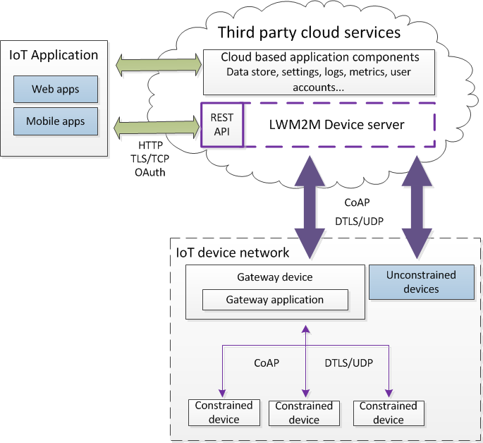
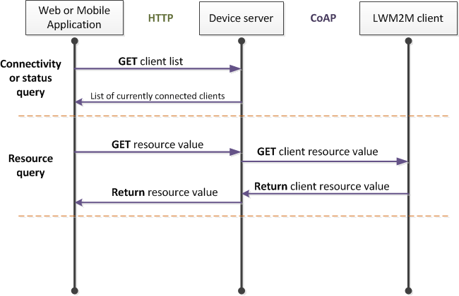
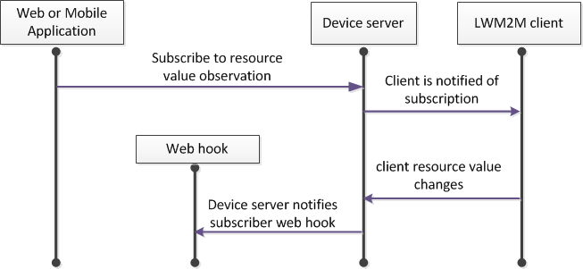

----

# LWM2M device management server
----

The device server is a LWM2M management server designed to be implemented alongside third party cloud services to integrate M2M capability into an IoT application. The device server exposes two secure interfaces; REST API/HTTPs and LWM2M/CoAP, and implements DTLS.  

The device server interfaces securely with LWM2M device networks via the Constrained Application Protocol (CoAP) and aids device and application interoperability by supporting both IPSO registered smart object definitions and custom object definitions.  

Device management is enabled through the implementation of the Open Mobile Alliance LWM2M standard. The CoAP interface and all LWM2M functionality is abstracted by the device server libraries, so intimate knowledge of LWM2M and CoAP is not required.  

Web and mobile applications interface with the device server via an authenticated REST API with a single entry point URL.

Since LWM2M relies on CoAP for communications, the device server acts as a bridge between the CoAP and HTTP protocols, allowing devices and applications which are outside the LWM2M device network to query resource and connectivity data using HTTP via the device server's REST API. No resource states are cached by the server, so all resource queries are propagated via CoAP directly to the targeted device/s. The device server does cache client connectivity status however, so this data is returned directly.  

The CoAP *Observe* verb is supported by registering (subscribing to) an observation with the device server which will POST a notification to a specified web hook when the value or state of the observed resource meets the desired criteria.

----

##  Getting started

### User guide

For an introduction to the device server, installation details, use of the REST API, client/device authentication and examples of common operations, see our [user guide.](doc/userGuide.md) 

----

## Contributing

We welcome all contributions to this project and we give credit where it's due. Anything from enhancing functionality to improving documentation and bug reporting - it's all good. 

Find out more in the [contributor guide](CONTRIBUTING.md).

## Credits

We would like to thank all of our current [contributors](CONTRIBUTORS).  

Special thanks to the [DTLS.Net](https://github.com/CreatorDev/DTLS.Net) team.  

## Development tasks

A list of ongoing development tasks can be seen [here](doc/tasks.md).

----

## License information.

* All code and documentation developed by Imagination Technologies Limited is licensed under the [BSD 3-clause license](IMGLicense.md).  
* CoAP.Net by Longxiang He is licensed under the [BSD 3-clause license](https://github.com/smeshlink/CoAP.NET/blob/master/LICENSE).  
* Bouncy Castle by The Legion of the Bouncy Castle is licensed under an [adaptation of the MIT X11 License](https://bouncycastle.org/csharp/licence.html).

----

----
----
