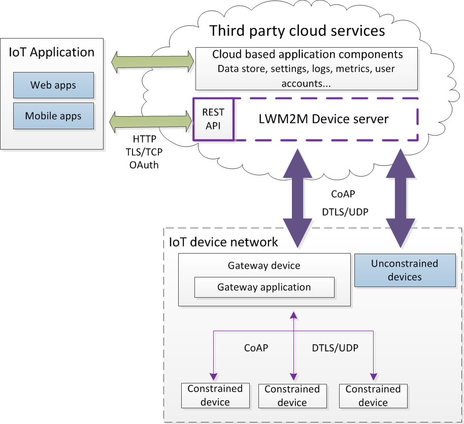
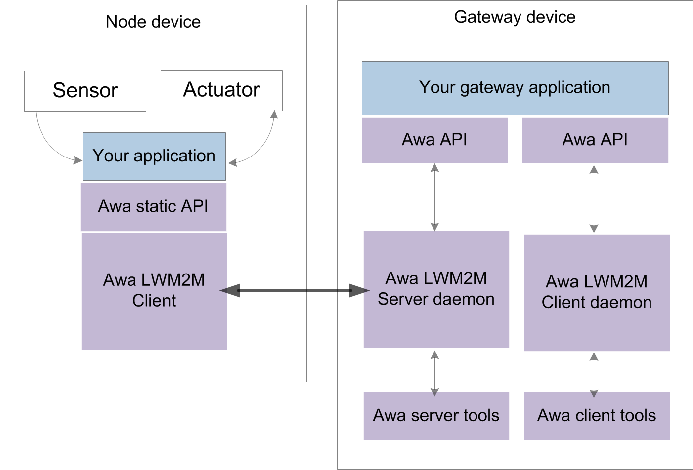
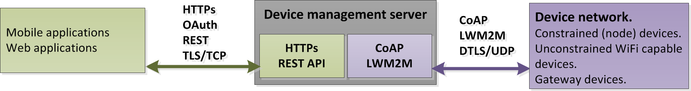



----

## Imagination Technologies Creator IoT Framework

Imagination Technologies' Creator IoT framework is a suite of open source software components that enable developers to rapidly prototype, develop and deploy distributed Lightweight M2M solutions for the Internet of Things (IoT).  

The key components of the framework are *Awa LightweightM2M* and the *Device server*.

### Awa LightweightM2M  

Awa LightweightM2M is a device side implementation of the OMA Lightweight M2M protocol that provides a secure and standards compliant solution to simplify the development of M2M applications. Awa LightweightM2M underpins the device's application code, abstracting LWM2M and CoAP functionality by providing an intuitive API that enables customization without the need for an intimate knowledge of M2M protocols.  
 
  

[Go here for complete Awa LightweightM2M source code, documentation and examples](https://github.com/FlowM2M/AwaLWM2M).  

Although knowledge of LWM2M and CoAP isn't essential it's wise to have a passing familiarity with the protocols. [Go here for an overview of LWM2M](lwm2mOverview.md).

### The device server  
The device server is a self-hosted LWM2M device bootstrap/management server with CoAP and REST interfaces. The purpose of the device server is to manage the provisioning, authentication and connectivity of IoT devices, to query and supply resource information, and to service CoAP *Observe* notifications.  
 
  
  

The device server acts as a bridge between CoAP/LWM2M on the device network side, and HTTP/REST on the internet side, allowing web and mobile applications to manage device connectivity and to utilise device side properties and resources.

CoAP *Observe* notifications are subscription based and supported by HTTP POST request to a specified web hook.  

**Note.** There is no support for user accounts or business logic on the device server. IoT application support services such as data storage, settings storage, logging, metrics etc. will require the use of additional third party resources such as AWS or Google cloud.
  
[Go here for complete device server source code, documentation and examples](https://github.com/Creatordev/DeviceServer).  

----

----
