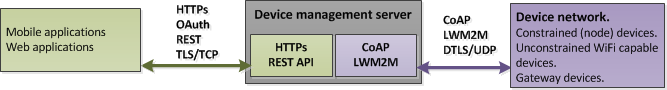

----

# The LWM2M device management server user guide  
The device server is a self-hosted LWM2M device bootstrap/management server with CoAP and REST interfaces. The purpose of the device server is to manage the provisioning, authentication and connectivity of IoT devices, to query and supply resource information, and to service CoAP *Observe* notifications.  
 
  
  

The device server acts as a bridge between CoAP/LWM2M on the device network side, and HTTP/REST on the internet side, allowing web and mobile applications to manage device connectivity and to utilise device side properties and resources.

## Contents

* [Introduction](doc/devServer.md)  
* [Installation and deployment](doc/Docker.md)  
* [The device server REST API](doc/DSRESTindex.md)  
    * [Client authentication](doc/authentication.md)  
	* [Device authentication](doc/devauth.md)  
	* [Response optimisation](doc/ResponseOptimization.md)  
	* [Common operations](doc/commonDeviceServerOperations.md)  
	* [Subscribing to CoAP observations](doc/subscribingToObservations.md)  
	* [Package versions](doc/packageVersions.md)  

----

----
